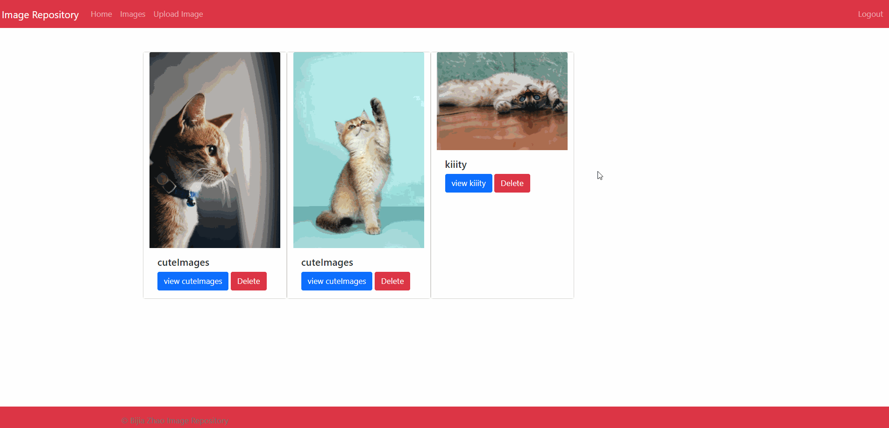
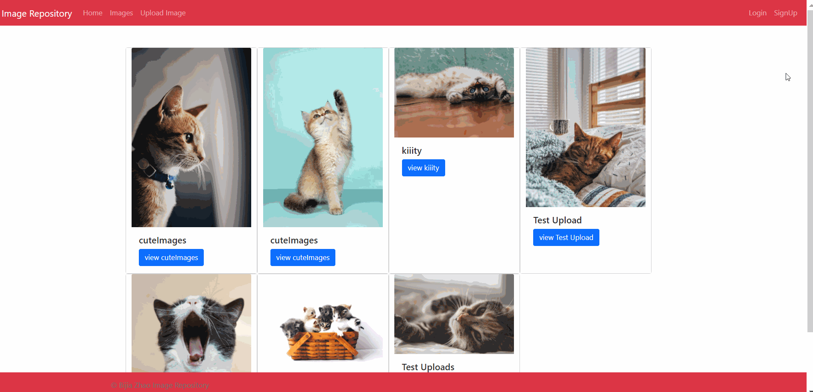

# Image Repository Application

- This Image Repository is created using NodeJS, Express, MongoDB (with GridFS)

### The application has the following features:
----
1. Display the uploaded images
2. Upload single/bulk images
3. Delete image (Only by authorized user)
4. Authentication and Authorization user Register/Login/Logout

### Instruction to run the application
----
1. Install MongoDB database on your machine
2. Application runs on 'mongodb://localhost:27017/image-repo', you can customize your MongoDB url
3. npm install all the dependencies.
4. run node app.js to start.

### Check if they are connected
----
1. with app running, open your browser in http://localhost:3000/
2. if you see the button "to images", it means it is connected.
3. register and feel free to upload images!

### Demo for the application
----
-Upload single/bulk images

-authentication

-delete imagte
